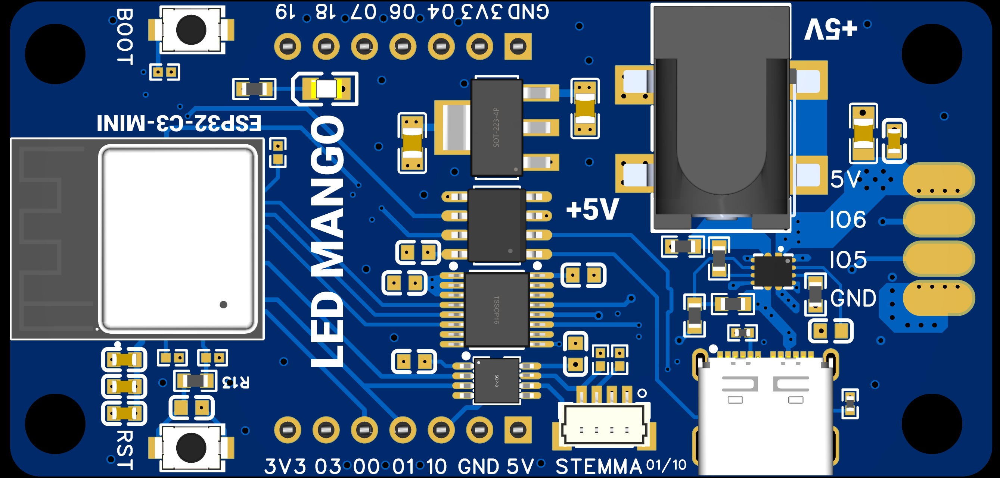
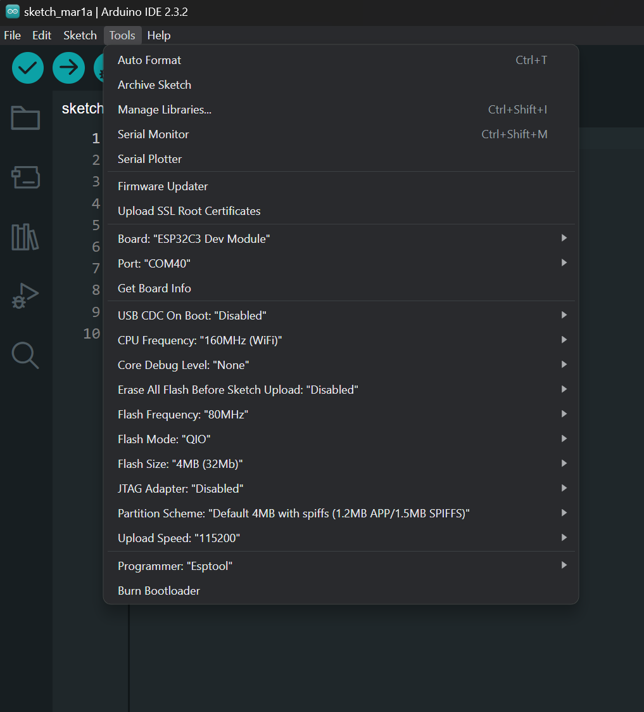
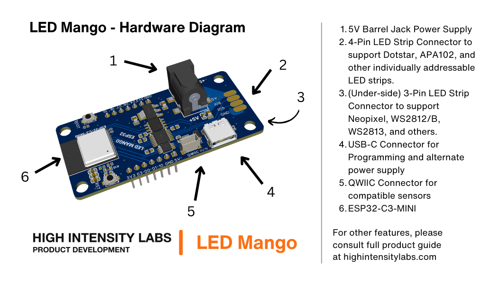

# LED_Mango
Open LED Driver

## Microcontroller
* ESP32-C3-MINI
* Build in USB-C to UART Programmer
* WiFi (802.11 b/g/n)
* Bluetooth 5
* 4 MB flash in chip package
* On­board PCB antenna
* Barrel Jack

## Specifications
* 5V LED Strips Supported (WS2812B, SK6812, Dotstar, Neopixel, etc.)
* 4.5Amp Power MUX
* LED Logic Level is 5V

## Pinout
STEMMA QT, QWIIC, and Grove I2C - GPIO01 GPIO10
create a table for md
| Pin | Function |
| --- | --- |
| GND | Common Ground |
| 3V3 | 3V3 Power Logic Level |
| 5V | 5V Power |
| IO0 | IO0,QWIIC I2C,ADC1_CH0 |
| IO1 | IO1,ADC1_CH1 |
| IO3 | IO3,ADC1_CH3 |
| IO4 | GPIO4,ADC1_CH4 |
| IO6 | GPIO6 |
| IO7 | GPIO7 |
| IO10 | GPIO10,QWIIC I2C |
| IO18 | GPIO18 |
| IO19 | GPIO19 |

## Strapping Pins
The LED Mango includes a USB to UART adapter for plug and play programming and debugging. You will need to hold the boot button during a reset to enter the bootloader.

## Getting Started with the Arduino IDE
1. Install the Arduino IDE
2. Add the ESP32 board support package to the Arduino IDE
3. Select `ESP32C3 Dev Module` as the board
4. Select the correct Port
5. Hold the Boot button during a power cycle to enter programming mode
6. Upload your sketch

## Diagram

## Author
High Intensity Labs, LLC